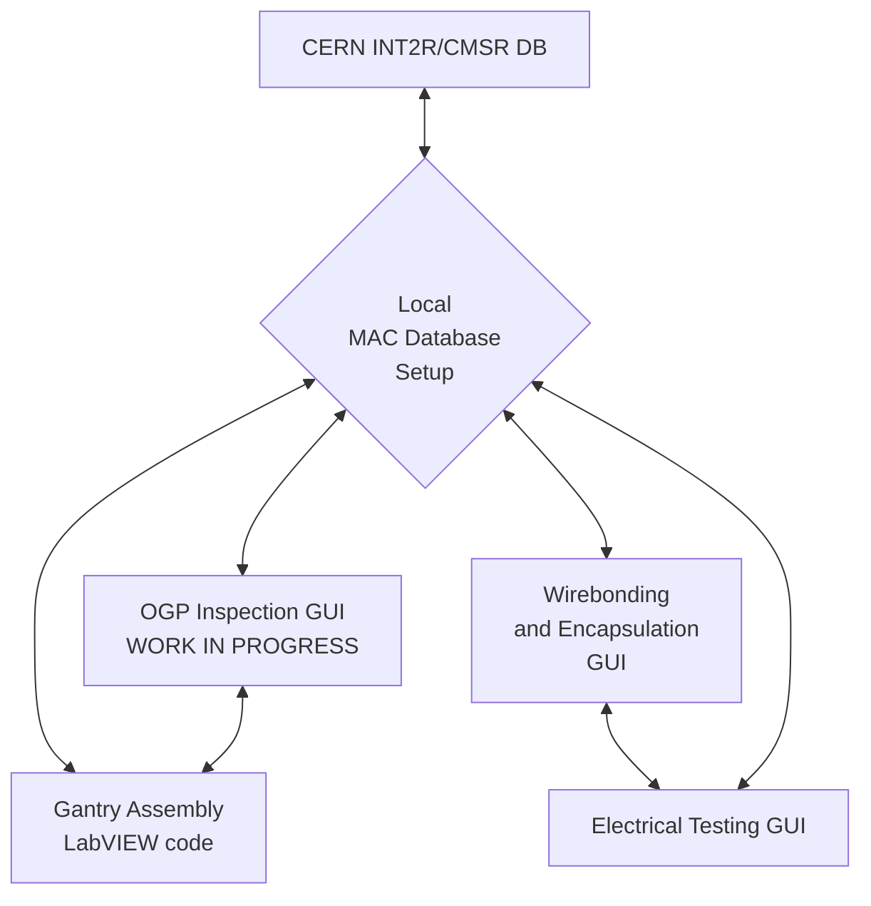

# MAC Projects

This flowchart outlines the various steps of HGCal Silicon Module Assembly at a Module Assembly Center (MAC). The code associated with the various steps are linked below.

## Related projects
- [Encapsulation procedure and programs for LD Full](https://github.com/cmu-hgc-mac/encapsulation)
- [Grafana Visualization Dashboard](https://github.com/cmu-hgc-mac/grafana_hgcdb_dashboard)
- [Ambient Temperature & Humidity DB Logging](https://github.com/cmu-hgc-mac/ambient-temp-humidity)
- [Ambient Particulate Counts DB Logging](https://github.com/cmu-hgc-mac/ambient-particulate-counts)

<!-- https://github.com/jparshook/UCSB-Gantry-master-main -->

