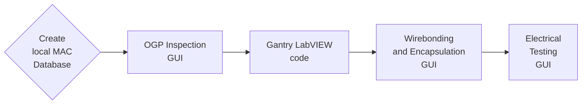

# Projects

```mermaid
graph LR
    A{Create<br>local MAC<br>Database} --> B[OGP Inspection<br>GUI]
    B --> C[Gantry LabVIEW<br>code]
    C --> D[Wirebonding<br>and Encapsulation<br>GUI]
    D --> E[Electrical<br>Testing<br>GUI]
    click A href "https://github.com/murthysindhu/HGC_DB_postgres/"
    click B href "https://github.com/cmu-hgc-mac/HGC_OGP_DB"
    click D href "https://github.com/nkalliney1/wirebonder_gui"
    click E href "https://gitlab.cern.ch/acrobert/hgcal-module-testing-gui/"

```
