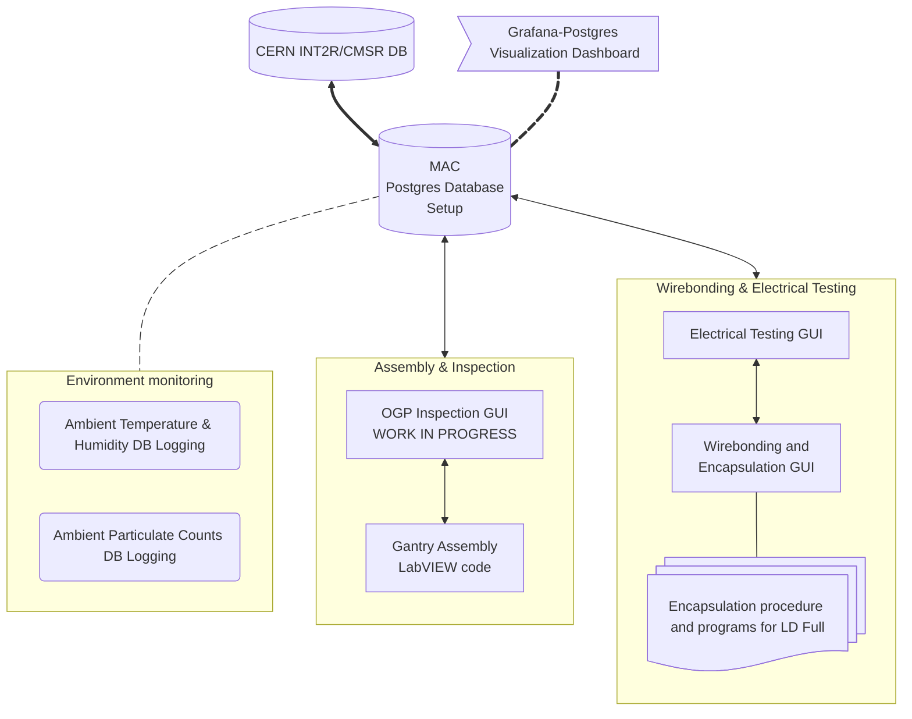

# MAC Projects

This flowchart outlines the various steps of HGCal Silicon Module Assembly at a Module Assembly Center (MAC). The [repositories](https://github.com/orgs/cmu-hgc-mac/repositories) associated with the various steps are linked below.

<!-- https://github.com/jparshook/UCSB-Gantry-master-main -->

